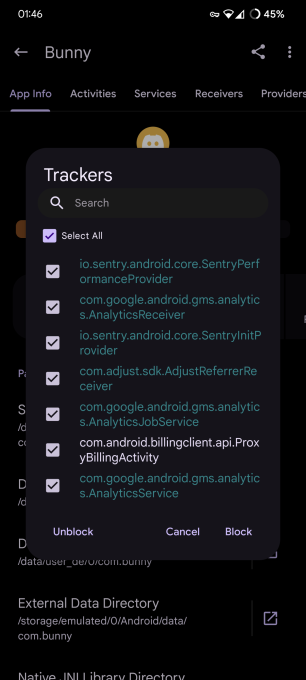

# discord-no-trackers
This is a project to remove (not disable or block) as many trackers as possible from the code of Discord's Android app.

# Trackers in the Discord app


App Manager reports 7 tracker components in the Discord app. AdjustReferrerReceiver and gms.analytics actually have no usages and can just be deleted. [Sentry](https://sentry.io/welcome/)'s tracking package is more difficult to remove and requires removing the usages in Discord's code (more on this process later).

In addition, Discord has its own analytics package, in com.discord.analytics, which is not reported by App Manager.

# Removal/Modification Process
[Video showing the removal process](https://www.youtube.com/watch?v=6GNFPOTawtc) (This is not a tutorial but if you really want to you can follow what I did). It doesn't include most of the optimizations at the end because of how long they take.

Note: If you really don't want to use MT Manager you can use this regex to clear void methods: ```(\.method\s(public|private|static)\s\b(?!\babstract|native\b).*\(.*\)V\n.()([\s\S]*?)(\.end method)```

Although Discord is a React Native app, fortunately, the trackers are present in the classes.dex files in the APK, which contain the Dalvik bytecode generated from Java/Kotlin code. This is likely as tracker packages are produced in native code to maintain compatibility with as many types of apps as possible.

Although APKs can be decompiled using open-source tools like apktool, I used the Android app [MT Manager](https://mt2.cn/) to remove these trackers, which is a file manager with a strong focus on APK modification, possessing several useful features to perform the measures necessary.

One of these features is being able to quickly clear a method while also optimizing the number of registers utilized by it. This is necessary in multiple places as attempting removal of any package from DEX requires removing all usages of it, mainly including invokations and usage of objects. I have worked on a regex pattern to quickly do this, however, for Discord, it mostly cannot be applied due to the nature of the usage of the trackers. Fortunately, this nature is more to the theme of being able to simply clear the methods containing the usage of the trackers as they are all related to tracking. There is one major exception; the part of the code which loads packages from DEX to React Native. There, each package is added to an ArrayList. In this case, the Sentry tracking package is loaded. I tried simply removing or nullifying the package initialization from the ArrayList, but the app always crashes. The only solution I found is to simply copy another one and paste it over the Sentry one.

When packages are removed from the DEX files, their declaration must also be removed from AndroidManifest.xml. XML files inside APKs are encoded to a specific format and need to be decompiled before editing. MT Manager supports this feature, but it requires VIP (paid).  I have worked on my own open source app for editing these AXML files - [AXML Editor](https://github.com/AbdurazaaqMohammed/AXML-Editor) based on the work of axml2xml by [apk-editor](https://github.com/apk-editor/aXML), [codyi96](https://github.com/codyi96/xml2axml), [hzw1199](https://github.com/hzw1199/xml2axml) and [l741589](https://github.com/l741589/xml2axml).

In the APKs provided in the [releases section](https://github.com/AbdurazaaqMohammed/discord-no-trackers/releases), I have additionally performed some optimizations to reduce the size of the APK file. These involve:
* Removing as many useless files as I am aware of and was able to delete
* Removing debug info from DEX (MT Manager and [APKTool M](https://maximoff.su/apktool) contain options for this)
* Removing Android.util.log() invokations from DEX (using [MPatcher](https://maximoff.su/mpatcher/))
* Optimizing images
* Removing useless BuildConfig and R* classes from DEX (using [MPatcher](https://maximoff.su/mpatcher/)) (This saved 30MB)
* Compressing the APK

# About [Pyoncord](https://github.com/pyoncord/Bunny)
The root version of Pyoncord works perfectly, just install and enable it in LSPosed as usual.

The non root solution provided on their GitHub won't work because Vendetta Manager doesn't support picking an APK to patch. Patching it with LSPatch works and I provided the pre-patched APK in releases (Note: [armeabi-v7a is not supported by Pyoncord](https://github.com/pyoncord/Bunny/issues/17)).
